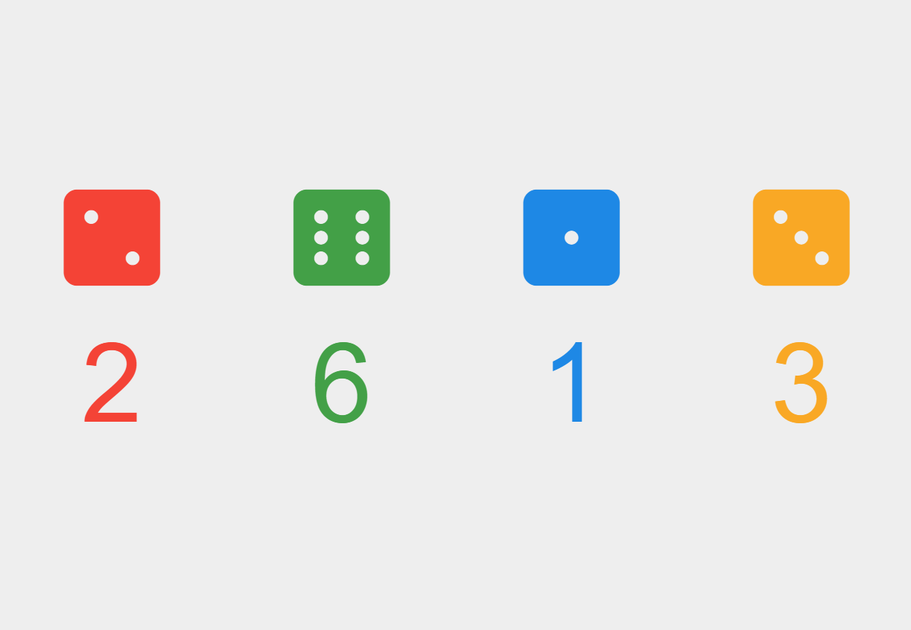

# Dice

Responsive web app that displays a set of rollable dice. Developed as an example app for a lunch-and-learn session on deploying static sites to Azure.



# Getting Started

```bash
npm start
```

# Build 

```bash
npm install
npm run build
```

# Dependencies

- react
- react-dom
- parcel
- rimraf